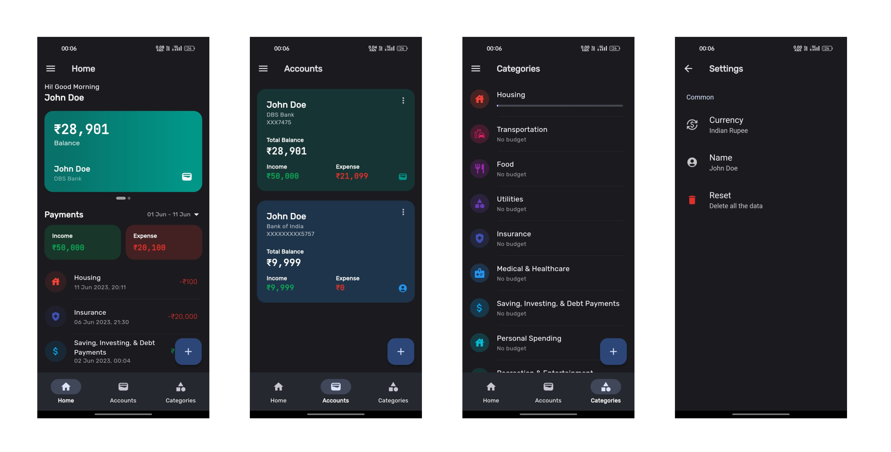

This is a Flutter application that helps you track your expenses and manage category budgets. It provides a user-friendly interface to enter and categorize your expenses, giving you insights into your spending habits and helping you stay within your budget.

## Features

- Track and record your expenses conveniently.
- Categorize your expenses into different categories.
- Set monthly budgets for each category and monitor your spending.
- View detailed expense reports and statistics.
- Easily search and filter your expenses.
- Export expense data for further analysis.

## Contributing

Contributions are welcome! If you find any issues or have suggestions for improvements, please open an issue or submit a pull request.

## License

This project is licensed under the MIT License. See the [LICENSE](LICENSE) file for more information.

## Acknowledgements

- This app was built using the Flutter framework. Learn more about Flutter at [flutter.dev](https://flutter.dev).
- The design and inspiration for this app came from various expense tracker apps available in the market.
- Special thanks to the open-source community for their valuable contributions.

